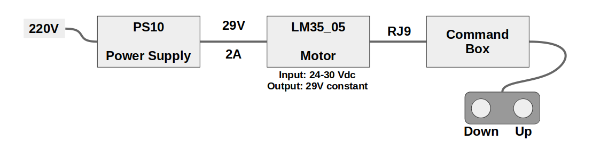

# BLE Sofa
Control module for CIAR sofa using custom BLE interface.

## Overview

The sofa command box is powered over a 4 pins RJ9 connector. The voltage measured at the command box input is 29V. It is provided by the motor (LM35_05) which gets its power from the PS10 adapter (29V - 2A).

The command box has three cable inputs:
- The RJ9 connector for power supply and motor commands
- The left input (J1) connected to the sensitive button; It corresponds to the Down command.
- The right input (J3) connected to the other sensitive button; It corresponds to the Up command.

## Power Supply and Motor Commands

The RJ9 connector provides 4 wires connection which supplies power from the motor to the control box, and Up and Down commands from the control box to the motor.

# Resources

* Raspberry Pi Pico power pins information:
https://dronebotworkshop.com/pi-pico/

* A nice development kit PCB example for Raspberry Pi Pico:
https://01001000.xyz/2021-02-13-Raspberry-Pi-Pico-dev-board-Kiwikit/

