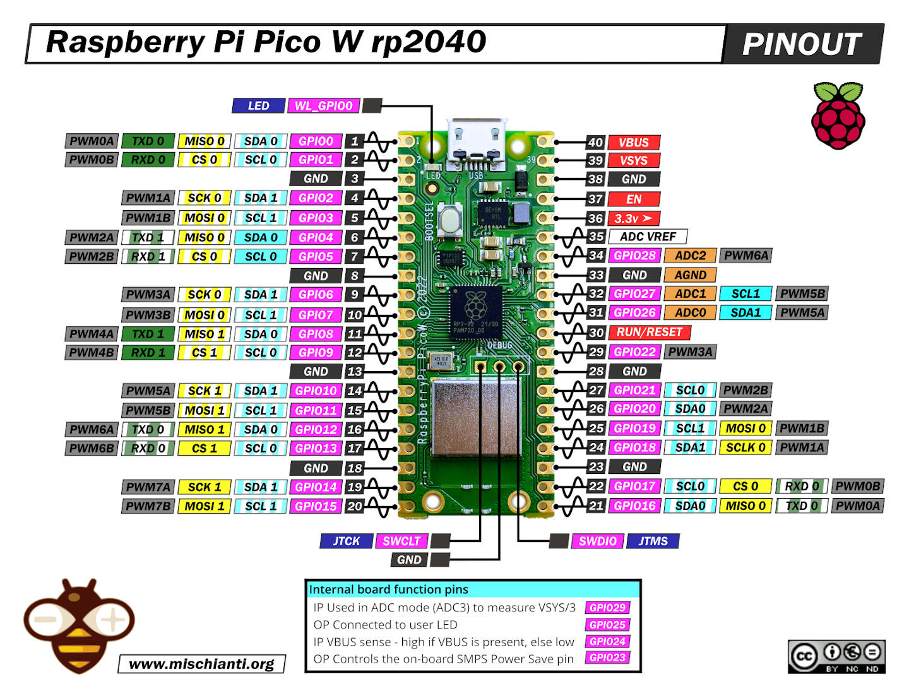

# BLE Sofa
Control module for CIAR sofa using custom BLE interface.

## Overview

The sofa command box is powered over a 4 pins RJ9 connector. The voltage measured at the command box input is 29V. It is provided by the motor (LM35_05) which gets its power from the PS10 adapter (29V - 2A).


The command box has three cable inputs:
- The RJ9 connector for power supply and motor commands
- The left input (J1) connected to the sensitive button; It corresponds to the Down command.
- The right input (J3) connected to the other sensitive button; It corresponds to the Up command.


## Power Supply and Motor Commands

The RJ9 connector provides 4 wires connection which supplies power from the motor to the control box, and Up and Down commands from the control box to the motor.


## Issue with the current system

Currently the command box is connected to the Up and Down button with electrical wires. The issue comes when moving the sofa up and down, the cables are compressed by the mechanical part and end up being damaged.

## Replacement Solution

A replacement solution has been specified to allow the user to control the sofa using a wireless BLE application. The system would be based on a Raspberry Pi Pico W module which permits to easily control the motor through two electrical relays, and to receive commands from the user via the Bluetooth stack.

<p float="left">
  
  
</p>

# Tools Setup

## Get the SDK and examples

```bash
cd pico
git clone https://github.com/raspberrypi/pico-sdk.git --branch master
cd pico-sdk
git submodule update --init
cd ..
git clone https://github.com/raspberrypi/pico-examples.git --branch master
```

## Install the toolchain

```bash
sudo apt update
sudo apt install cmake gcc-arm-none-eabi libnewlib-arm-none-eabi build-essential libstdc++-arm-none-eabi-newlib
```

In the bashrc file, export the path to the SDK:
```bash
#
# RPi Pico SDK
#
export PICO_SDK_PATH=/home/laurent/Projects/lgantel/ble_sofa/pico/pico-sdk
```


# Example Projects

```bash
cd pico/workspace
mkdir build
cd build
```

The following examples can be built:

- [LED Control](doc/example_projects.md#led-control)
- [BLE Control](doc/example_projects.md#ble-control)
- [Relay Control](doc/example_projects.md#relay-control)

# Resources

## Raspberry Pi Pico

* Raspberry Pi Pico power pins information:

https://dronebotworkshop.com/pi-pico/

* A nice development kit PCB example for Raspberry Pi Pico:

https://01001000.xyz/2021-02-13-Raspberry-Pi-Pico-dev-board-Kiwikit/

* C library for LCD OLED:

https://github.com/martinkooij/pi-pico-ss-oled

* Information on the debug probes:

https://www.framboise314.fr/tout-nouveau-la-sonde-de-debogage-raspberry-pi-debug-probe/

## Bluetooth Low Energy

* Bluetooth BLE resources:

http://tvaira.free.fr/bts-sn/activites/activite-ble/bluetooth-ble.html#gatt-et-att

https://novelbits.io/bluetooth-gatt-services-characteristics/

https://www.jaredwolff.com/get-started-with-bluetooth-low-energy/
