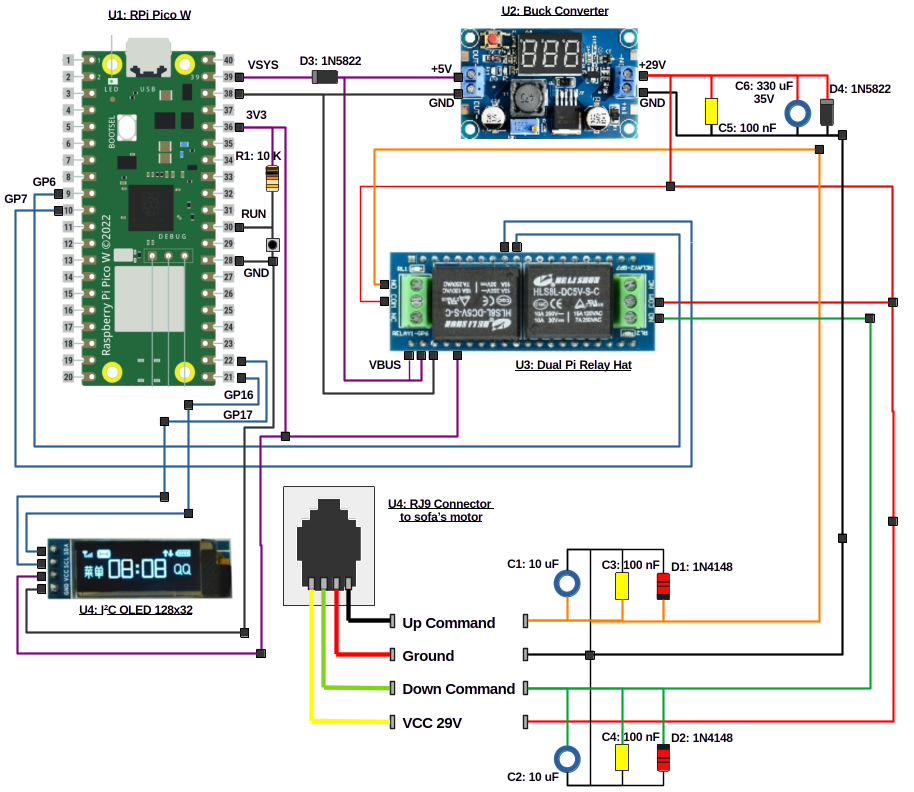

# BLE Sofa Application

## Block Diagram

## Description

The Raspberry Pi Pico W (U1) is powered by a buck converter (U2) that converts the 29V coming from the sofa controller, to a 5V power line.

## Embedded Software Application

- WiFi server with REST API.