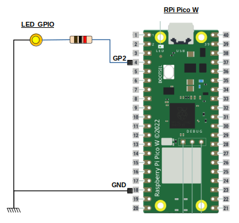
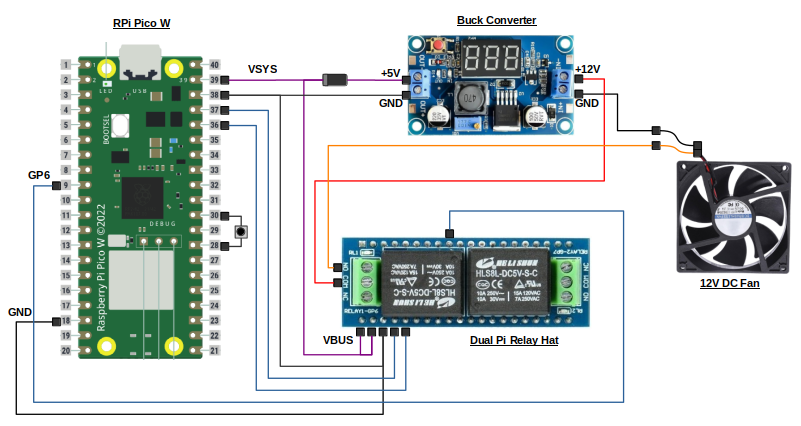

# Example Projects

## LED Control

### Block Diagram


### Description

- LED_Toggle is controlled via GP2 and is toggled every 500 ms.
- LED_Control is controlled via GP3 and its status is dependent of the state of the S1 button. In our case, the S1 button is active-low.

### Compilation

```bash
cmake ..
make -j4 led_control
```

## BLE Control

### Block Diagram



### Description

In this example project, the BLE stack is activated and a GATT profile is provided by the Raspberry Pi Pico.

### Compilation

```bash
cmake -DPICO_BOARD=pico_w ..
make -j4 ble_control
```

### Test

1. Test detection on Linux

Scan of the available BLE devices:
```bash
sudo hcitool lescan
LE Scan ...
43:43:A2:12:1F:AC ble-control
```

2. Connection in interactive mode to the BLE Control device:
```bash
sudo gatttool -b 43:43:A2:12:1F:AC -I
[43:43:A2:12:1F:AC][LE]> connect
Attempting to connect to 43:43:A2:12:1F:AC
Connection successful
```

3. Read the primary services provided by the BLE Control device. Our custom service has the UUID 0000ff10-0000-1000-8000-00805f9b34fb. It defines a characteristic that can be written to control the LED state (UUID 0000ff11-0000-1000-8000-00805f9b34fb):
```bash
> primary
attr handle: 0x0001, end grp handle: 0x0003 uuid: 00001800-0000-1000-8000-00805f9b34fb  <-- Generic Access Profile
attr handle: 0x0004, end grp handle: 0x0006 uuid: 0000ff10-0000-1000-8000-00805f9b34fb  <-- Our control service
> char-desc 0x0001
handle: 0x0001, uuid: 00002800-0000-1000-8000-00805f9b34fb  <-- Primary service
handle: 0x0002, uuid: 00002803-0000-1000-8000-00805f9b34fb  <-- Characteristic information
handle: 0x0003, uuid: 00002a00-0000-1000-8000-00805f9b34fb  <-- Generic Access service (name)
handle: 0x0004, uuid: 00002800-0000-1000-8000-00805f9b34fb  <-- Primary service
handle: 0x0005, uuid: 00002803-0000-1000-8000-00805f9b34fb  <-- Characteristic information
handle: 0x0006, uuid: 0000ff11-0000-1000-8000-00805f9b34fb  <-- LED control custom characteristic
```

4. The value of the characteristic can be read with the char-read-hnd command:
```bash
char-read-hnd 0x0006
Characteristic value/descriptor: 00
```

5. The characteristic being a write-without-response characteristic, we use the char-write-cmd command to write on it:
```bash
# Set the LED on
char-write-cmd 0x0006 01
# Set the LED off
char-write-cmd 0x0006 00
```

### Android Application

An Android application has been developped to test the BLE Control example via a smartphone. The application is available in android/workspace/ble_control/.

## Relay Control

### Block Diagram



### Description

In this example project, the Raspberry Pi Pico controls the relay 1 of the Dual Pi Relay Hat via the GPIO 6. 
- The relay is connected to a 12V DC fan
- The relay is turned on during 5 seconds
- The relay is then turned off for 3 seconds

### Compilation

```bash
cmake -DPICO_BOARD=pico_w ..
make -j4 relay_control
```

### References

- Pico Dual Channel Relay Hat

Information about the relay hat can be found here:

[https://learn.sb-components.co.uk/Pico-Dual-Channel-Relay-Hat]

and there:

[https://github.com/sbcshop/Pico-dual-channel-Relay-HAT]

- Known Issues with Relays:

[https://electronics.stackexchange.com/questions/631931/ac-current-on-relay-causes-pi-pico-to-reboot-continuously]

[https://forums.raspberrypi.com/viewtopic.php?t=322133]

[https://forums.raspberrypi.com/viewtopic.php?t=64595]

[https://forums.raspberrypi.com/viewtopic.php?f=91&t=83372&p=1225448#p1225448]

- Circuit for 29v to 5v converter:

[https://electronics.stackexchange.com/questions/588770/logic-level-converter-from-29v-to-5v-schematic]
